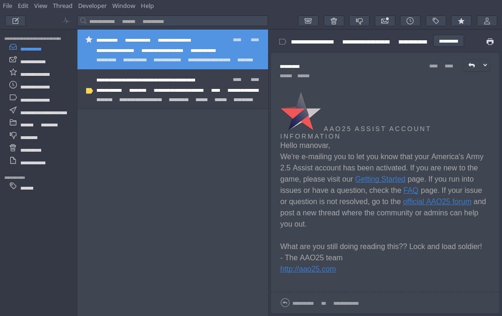

# Nylas Arc Dark Theme

Arc Dark theme for mail client [Nylas N1](https://github.com/nylas/N1)




# Install
Download [ZIP-archive](https://github.com/varlesh/Nylas-Arc-Dark-Theme/archive/master.zip) and extract. Run Nylas N1, select **Edit - Install Theme...** and choose folder.

# For KDE

Better use [Arc Dark KDE](https://github.com/varlesh/Arc-Dark-KDE) pack and run this command, after install:
```
sed -i 's|2F343F|383C4A|g' ~/.nylas/packages/arc-dark/styles/ui-variables.less
```

